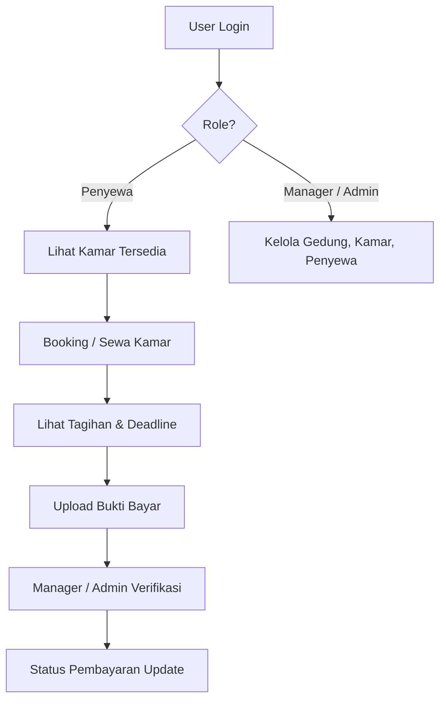

# 🏠 Rumah Sewa Biru Laut — Backend

<div align="center">


**Backend Aplikasi Sistem Sewa Rumah Kos Biru Laut**

🟢 **Status**: Payment API Ready | Sprint 1 Minggu 10

[🌐 Live API](https://rumahsewabl-be-production.up.railway.app) · [📋 Endpoints](#-api-endpoints) · [⚙️ Setup](#️-setup--instalasi)

</div>

---

## 📋 Informasi Project

| Field | Detail |
|---|---|
| **Project** | Rumah Sewa Biru Laut |
| **Mata Kuliah** | Manajemen Proyek Teknologi Informasi |
| **Stack BE** | Laravel 13 + JWT Auth |
| **Stack FE** | Flutter Web |
| **Database** | MySQL (Hostinger) |
| **Deployment** | Railway |

**Live URL**: `https://rumahsewabl-be-production.up.railway.app/api`

---

## 🔄 Alur Aplikasi



### User Flow Detail

**Login** → Mendapat JWT Token + Role

| Role | Alur |
|---|---|
| **Penyewa** | Lihat kamar → Booking → Bayar → Upload bukti |
| **Manager** | Kelola gedung & kamar → Verifikasi/Tolak pembayaran |
| **Administrator** | Semua akses + monitoring log aktivitas |

---

## 🗄️ Database

| Tabel | Keterangan |
|---|---|
| `roles` | Role: administrator, manager, penyewa |
| `users` | Data login |
| `tenants` | Profil penyewa |
| `buildings` | Data gedung |
| `rooms` | Data kamar |
| `rentals` | Data kontrak penyewaan |
| `payment_deadlines` | Deadline pembayaran |
| `payments` | Riwayat pembayaran + bukti |
| `notifications` | Notifikasi sistem |
| `activity_logs` | Log aktivitas admin |

---

## ⚙️ Setup & Instalasi

### Requirements

- PHP ≥ 8.2
- Composer ≥ 2.x
- MySQL ≥ 8.0
- Laragon (rekomendasi local)

### Langkah Instalasi

```bash
git clone https://github.com/Mikhael-agung/RumahSewaBL-BE.git
cd RumahSewaBL-BE

composer install
cp .env.example .env

php artisan key:generate
php artisan jwt:secret
php artisan storage:link

php artisan serve
```

---

## 🔐 Autentikasi

Menggunakan **JWT** (`tymon/jwt-auth`). Setiap request ke endpoint protected wajib menyertakan header:

```
Authorization: Bearer <token>
```

---

## 📋 API Endpoints

**Base URL**: `/api`

### Public

| Method | Endpoint | Deskripsi |
|---|---|---|
| `GET` | `/health` | Health check |
| `POST` | `/login` | Login user |

### Protected

| Method | Endpoint | Role | Deskripsi |
|---|---|---|---|
| `POST` | `/logout` | Semua | Logout |
| `GET` | `/me` | Semua | Data user saat ini |
| `POST` | `/payments/upload` | penyewa | Upload bukti pembayaran |
| `GET` | `/payments/history` | penyewa | Riwayat pembayaran |
| `GET` | `/payments/pending` | manager, admin | List pembayaran pending |
| `POST` | `/payments/{id}/verify` | manager, admin | Verifikasi pembayaran |
| `POST` | `/payments/{id}/reject` | manager, admin | Tolak pembayaran |

> CRUD Gedung, Kamar, dll masih dalam pengembangan.

---

## 👥 Role & Akses

| Role | Akses Utama |
|---|---|
| `administrator` | Full akses + activity log |
| `manager` | Verifikasi pembayaran, kelola gedung/kamar/penyewa |
| `penyewa` | Upload bukti bayar, lihat riwayat & tagihan |

---

## 🚀 Sprint Progress

### ✅ Sprint 1 — Minggu 10

- [x] Payment API (upload, verify, reject, history)
- [x] JWT Auth + Role Middleware
- [x] Deploy ke Railway
- [x] Validasi file bukti pembayaran

### 🔜 Next Sprint

- [ ] CRUD Gedung
- [ ] CRUD Kamar
- [ ] CRUD Tenant
- [ ] Rental Management

---

<div align="center">

*Last updated: 24 Mei 2026*

</div>
